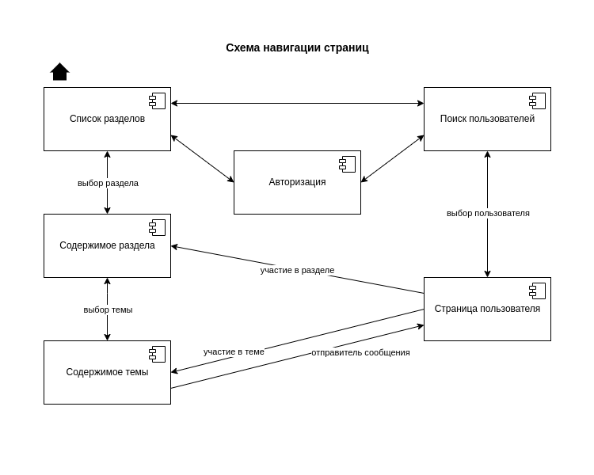
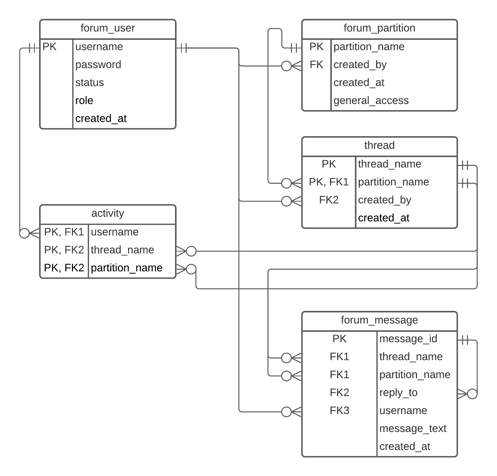

# Web-приложение
## Описание страниц

Ссылки на страницу Авторизации, Поиск пользователей и Список разделов доступны из любой страницы.

### Список разделов
1. Лого форума
2. Красивое оформление
3. Ссылки на разделы форума
4. (Для модераторов) Кнопка "Скрыть раздел для общего доступа"
5. (Для модераторов) Кнопка "Добавить новый раздел"

### Авторизация
1. Поля для заполнения данных (Login/пароль)
2. Кнопка "Войти"

### Поиск пользователей
1. Поиск по имени
2. Фильтрация по участию в разделах/темах
3. Фильтрация по активности (в т.ч. за определенный промежуток)
4. Кнопка "Мой профиль"
5. (Для модераторов) Кнопка "Добавить пользователя"

### Страница пользователя
1. Аватарка
2. Имя пользователя, статус
3. Список разделов/тем, в которых пользователь участвует
4. Последние сообщения на форуме
5. (Для своего пользователя) Кнопка "Редактировать профиль"
6. (Для модераторов) Кнопка "Заблокировать пользователя"

### Содержимое раздела
1. Список тем
2. Число сообщений по каждой теме
3. Время создания темы
4. Автор темы
5. Поиск по названию
6. Метки темы (важное/развлечения/прочее)
7. Кнопка "Создать новую тему"
8. (Для модераторов) Кнопка "Удалить тему"

### Содержимое темы
1. Шапка темы (название, автор, время создания, метка)
2. Список сообщений по теме (время, автор, нумерация, ссылка на другое сообщение в теме)
3. Кнопка "Отправить сообщение"
4. Переход на страницы темы
5. (Для модераторов) Кнопка "Удалить сообщение"

## Возможные сценарии использования
- Участие в обсуждении по теме
  0. Авторизация по логину/паролю на странице Авторизации
  1. Переход на страницу Списка разделов
  2. Переход на страницу Содержимого раздела
  3. Поиск темы по названию, переход на страницу Содержимого темы
  4. Выбрать сообщение для ответа либо начать новое сообщение
  5. (опционально) Добавить вложение(я)
- Добавление новой темы в разделе
  0. Авторизация по логину/паролю на странице Авторизации
  1. Переход на страницу Списка разделов
  2. Переход на страницу Содержимого раздела
  3. Создание новой темы через кнопку "Создать новую тему"
  4. Заполнение полей данных новой темы
- Обновление статуса/аватара своего пользователя
  0. Авторизация по логину/паролю на странице Авторизации
  1. Переход на страницу Поиска пользователей
  2. Переход на свою страницу по кнопке "Мой профиль"
  3. Редактирование профиля по кнопке "Редактировать профиль"
  4. Заполнение нового статуса/смена аватара по кнопке "Сменить аватар"
- Поиск общих с другим пользователем тем для обсуждения
  0. Поиск пользователя на соответствующей странице либо по сообщению в теме
  1. Переход на страницу пользователя
  2. Поиск по списку тем, в которых пользователь принимает участие
- (Для модераторов) Бан пользователя по имени
  0. Авторизация по логину/паролю на странице Авторизации в качестве модератора
  1. Переход на страницу Поиска пользователя
  2. Поиск пользователя по имени в поисковой строке
  3. Переход на страницу пользователя
  4. Кнопка "Заблокировать пользователя"
- (Для модераторов) Бан пользователя с малой активностью
  0. Авторизация по логину/паролю на странице Авторизации в качестве модератора
  1. Переход на страницу Поиска пользователя
  2. Поиск пользователя по активности но форуме за промежуток времени
  3. Переход на страницу пользователя
  4. Кнопка "Заблокировать пользователя"
- (Для модераторов) Удаление нежелательной темы
  0. Авторизация по логину/паролю на странице Авторизации в качестве модератора
  1. Переход на страницу Списка разделов
  2. Переход на страницу Содержимого раздела
  3. Поиск темы по названию
  4. Кнопка "Удалить тему"
## Схема базы данных

